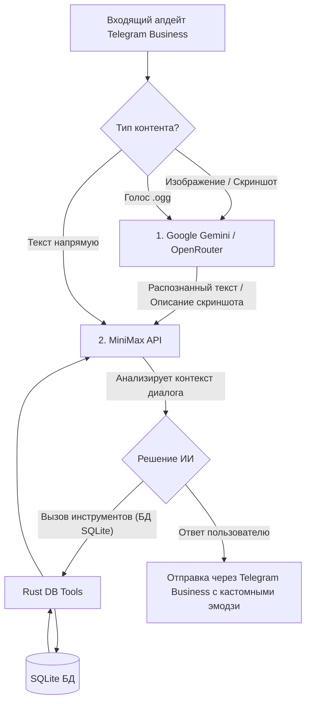

# Архитектурная концепция: Telegram Personal Bot & Seller (Rust)

В данном документе собрана обновленная и точная спецификация персонального Telegram-ассистента и продавца. Концепция полностью синхронизирована с предоставленными CSV-таблицами и логикой работы ИИ-агента из n8n.

---

## 1. Системные требования и окружение (Железо)

Бот развертывается непосредственно на мобильном устройстве пользователя и работает автономно в фоновом режиме.

* **Смартфон**: Samsung Galaxy Flip 3 (ядра: 1x Cortex-X1 @ 2.84 ГГц, 3x Cortex-A78 @ 2.42 ГГц, 4x Cortex-A55 @ 1.80 ГГц).
* **Свободные ресурсы**: **4 ГБ оперативной памяти (RAM)** и **200 ГБ физической памяти (ROM)** (накопитель UFS 3.1).
* **Среда выполнения**: **Debian GNU/Linux**, запущенный внутри **Chroot**-окружения на Android.
* **Платформа**: Нативная компиляция Rust под архитектуру **ARM64 (aarch64)**.

---

## 2. Двухэтапный мультимодальный конвейер ИИ (Multi-stage AI Pipeline)

Логика обработки входящих сообщений разделена на этапы распознавания (Gemini) и ведения диалога/вызова инструментов (MiniMax):



### Этап 1: Распознавание (Google Gemini через OpenRouter или напрямую)
Если пользователь отправляет мультимодальный контент:
* **Голосовые сообщения (.ogg)**: Бот скачивает аудиофайл и отправляет его в API Google Gemini. Gemini транскрибирует аудио в текстовый формат.
* **Изображения (фото товара, скриншоты оплат)**: Бот скачивает изображение и отправляет в Gemini. Модель распознает текст на скриншоте (сумму, дату, статус) или описывает то, что изображено на фото товара.

### Этап 2: Диалог и Вызов Инструментов (MiniMax API)
* Исходный текст сообщения клиента **ИЛИ** текст, полученный после распознавания на Этапе 1 (транскрипция голоса/описание картинки), передается в **MiniMax API**.
* MiniMax является "мозгом" ассистента: он анализирует контекст диалога, принимает решения и с помощью встроенных инструментов (функций) взаимодействует с базой данных SQLite на телефоне.
* MiniMax также следит за правилом "2 цифр" (валидирует ответы клиента, содержащие числовые коды) и решает, когда поставить **лайк (реакцию)** на сообщение через Telegram API.

---

## 3. Схема базы данных SQLite (на основе твоих CSV)

Структура таблиц полностью соответствует полям и типам данных из файлов в папке `C:\Users\tolib\Documents\tables`:

```sql
-- Таблица контактов/клиентов (Contacts.csv)
CREATE TABLE IF NOT EXISTS contacts (
    chat_id INTEGER PRIMARY KEY,        -- ID чата пользователя в Telegram
    first_name TEXT,                    -- Имя
    address TEXT,                       -- Адрес доставки
    phone_number TEXT,                  -- Номер телефона
    username TEXT,                      -- Юзернейм (@username)
    nickname TEXT                       -- Никнейм
);

-- Таблица товаров и парфюмерии (Catalog.csv)
CREATE TABLE IF NOT EXISTS catalog (
    product_id INTEGER PRIMARY KEY,      -- ID товара (например, 11100)
    product_name TEXT NOT NULL,         -- Название парфюма
    standard_price INTEGER NOT NULL,    -- Стандартная цена (например, 8000)
    stock_quantity INTEGER NOT NULL,    -- Количество на складе
    tags TEXT,                          -- Теги (например: "Citrus, Spicy, Woody")
    notes TEXT,                         -- Ноты аромата (описание пирамиды)
    suitable_season TEXT,               -- Подходящий сезон
    suitable_situation TEXT,            -- Подходящая ситуация (день, вечер, свидание)
    duration TEXT,                      -- Стойкость аромата (например: "8-10 hours")
    sillage TEXT                        -- Шлейф (например: "Moderate")
);

-- Таблица заказов (Orders.csv)
CREATE TABLE IF NOT EXISTS orders (
    order_id TEXT PRIMARY KEY,          -- ID заказа (генерируется как миллисекунды Date.now(), например "1778900618944")
    chat_id INTEGER NOT NULL REFERENCES contacts(chat_id),
    status TEXT NOT NULL,               -- Статус заказа ('pending', 'paid', 'shipped', 'cancelled')
    delivery_address TEXT,              -- Адрес доставки для этого заказа
    total_amount INTEGER NOT NULL       -- Общая сумма заказа
);

-- Позиции в заказе (Order_Items.csv)
CREATE TABLE IF NOT EXISTS order_items (
    item_id TEXT PRIMARY KEY,           -- ID позиции (генерируется как уникальный ключ)
    order_id TEXT NOT NULL REFERENCES orders(order_id) ON DELETE CASCADE,
    product_id INTEGER NOT NULL REFERENCES catalog(product_id),
    quantity INTEGER NOT NULL CHECK(quantity > 0),
    price_at_sale INTEGER NOT NULL      -- Цена на момент продажи
);

-- Системные настройки и токены
CREATE TABLE IF NOT EXISTS settings (
    key TEXT PRIMARY KEY,
    value TEXT NOT NULL
);

-- Медиа-файлы агента (имиджи, доступные ИИ)
CREATE TABLE IF NOT EXISTS agent_media (
    id INTEGER PRIMARY KEY AUTOINCREMENT,
    file_path TEXT NOT NULL,
    telegram_file_id TEXT,
    title TEXT NOT NULL,
    purpose TEXT NOT NULL,
    is_allowed_for_ai BOOLEAN DEFAULT 1
);
```

---

## 4. Логика Инструментов (Tools) ИИ-агента (на основе n8n workflow)

В Rust-приложении мы реализуем функции (инструменты для MiniMax), в точности повторяющие логику твоих узлов в n8n:

1. **`get_contacts` (Получить контакт)**:
   * Фильтр: `chat_id == business_message.chat.id`.
   * Возвращает данные клиента из таблицы `contacts`.
2. **`update_contacts` (Обновить контакт)**:
   * Фильтр: `chat_id == business_message.chat.id`.
   * Обновляет поля: `first_name`, `phone_number`, `address` на основе данных, полученных MiniMax в ходе диалога.
3. **`get_catalog` (Получить весь каталог)**:
   * Выгружает список всех товаров из таблицы `catalog` для подбора парфюмерии ИИ-агентом.
4. **`update_catalog` (Обновить остатки на складе)**:
   * Обновляет поле `stock_quantity` у конкретного `product_id`.
5. **`insert_order` (Создать новый заказ)**:
   * Генерирует уникальный `order_id` на основе системного времени в миллисекундах (эквивалент `Date.now()`).
   * Записывает в таблицу `orders` поля: `order_id`, `chat_id`, `status` (обычно 'pending'), `delivery_address` и `total_amount`.
6. **`insert_order_items` (Добавить позиции в заказ)**:
   * Записывает в таблицу `order_items` выбранные товары, их количество (`quantity`), цену на момент продажи (`price_at_sale`), привязывая их к сгенерированному `order_id`.
7. **`get_orders` (Получить заказы пользователя)**:
   * Фильтр: `chat_id == business_message.chat.id`.
   * Возвращает список заказов клиента.
8. **`get_order_items` (Получить позиции конкретного заказа)**:
   * Фильтр: `order_id`.
9. **`update_order` (Обновить параметры заказа)**:
   * Фильтр: `chat_id == business_message.chat.id` AND `order_id`.
   * Позволяет изменить `status`, `delivery_address` или `total_amount`.
10. **`update_order_items` (Обновить позиции)**:
    * Фильтр: `order_id` (или `item_id`).
    * Обновляет количество `quantity` или `price_at_sale`.

---

## 5. Веб-интерфейс управления (`localhost` на Rust)

Для управления ботом используется веб-интерфейс на базе **Axum + Askama**:

1. **Dashboard**: Статус работы бота, мониторинг системных ресурсов смартфона (RAM, CPU), графики заказов и выручки на основе таблиц `orders` и `sales`.
2. **Конфигурация**: Настройка токена Telegram-бота, Chat-ID для алёртов, ключей API (MiniMax, Google Gemini / OpenRouter).
3. **Логи и Алёрты**: WebSocket-консоль для просмотра логов в реальном времени. В случае сбоев (ошибка обращения к ИИ, паника в Rust) бот мгновенно отправляет оповещение администратору.
4. **Медиа-менеджер**: Раздел для загрузки имиджей, настройки тегов и переключения доступа: какие изображения ИИ может слать клиентам (например, фото флаконов парфюма, скриншот с реквизитами для перевода оплаты), а какие заблокированы.
