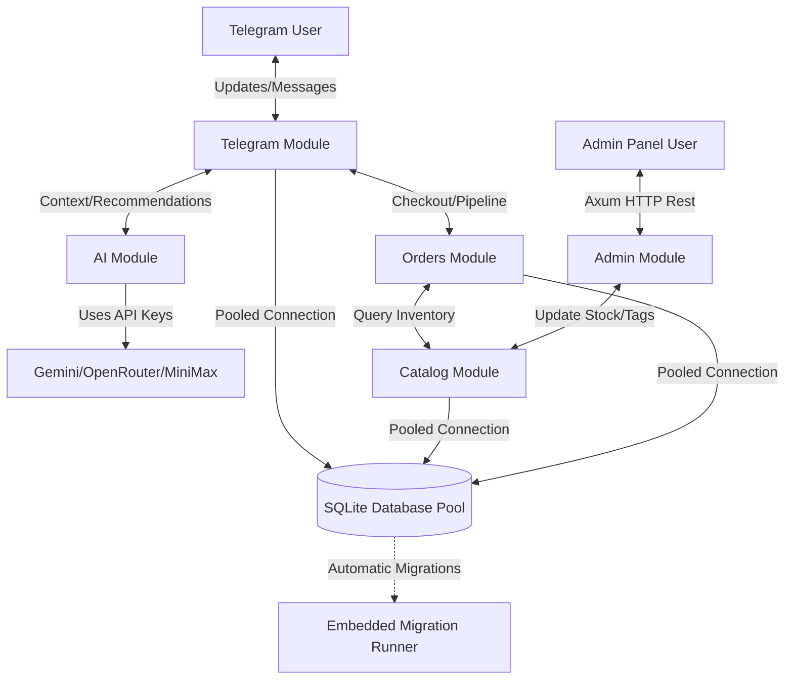

[← Getting Started](getting-started.md) · [Back to README](../README.md) · [Configuration →](configuration.md)

# Architecture Overview

`telegram-bot-seller` is structured using a **Modular Monolith** architecture. This pattern provides clean boundaries between functional domain modules while utilizing a lightweight Shared Core for infrastructure concerns (like database pools, configuration loading, error mapping, and safety alerts).

---

## Directory Structure

Here is a visual map of the project layout:

```text
telegram-bot-seller/
├── .github/workflows/       # GitHub Actions CI pipelines (lint, test, build)
├── data/                    # Local database files
├── src/
│   ├── main.rs              # Application entry point
│   ├── lib.rs               # Library root (exports shared and modules)
│   ├── migrations/          # SQLite raw SQL migrations (001_init.sql)
│   │
│   ├── shared/              # Shared Core (Infrastructure / Utilities)
│   │   ├── mod.rs
│   │   ├── config.rs        # Config parser (loads .env / validates vars)
│   │   ├── db.rs            # Connection Pool manager (WAL, Foreign keys, migrations)
│   │   ├── error.rs         # Unified AppError mapping
│   │   ├── types.rs         # Strong domain newtypes (ChatId, ProductId)
│   │   └── alerting.rs      # Global panic hook & admin alert channel
│   │
│   └── modules/             # Functional Monolith Modules (Domain logic)
│       ├── mod.rs           # Module registry
│       ├── telegram/        # Telegram Bot handler loop
│       ├── ai/              # AI LLM integrations (Gemini, OpenRouter, MiniMax)
│       ├── catalog/         # Product catalog management
│       ├── orders/          # Order pipeline and state machine
│       ├── contacts/        # Client and user contacts profile management
│       ├── media_manager/   # Media uploading and file storage
│       └── admin/           # Web-based Admin dashboard API
│
└── tests/                   # Core integration test suites
```

---

## Module Architectural Rules

To maintain the architectural health of the Modular Monolith, code must adhere to these rules:

1.  **Shared Core Independence**: Files inside `shared/` must never import anything from `modules/`. They are strictly for infrastructure and utility support.
2.  **Explicit Communication**: Modules inside `modules/` should interact with other modules via clean library APIs or messages, rather than directly modifying other modules' private states.
3.  **Unified Error Domain**: All failures across modules are converted into the unified `AppError` type in `shared::error` for safe bubble-up handling.
4.  **No Type Pollution**: Use `shared::types` newtype wrappers (e.g., `ChatId`, `ProductId`, `OrderId`) instead of raw integers/strings to prevent logic bugs.

---

## System Workflow Diagram



---

## See Also

*   [Getting Started](getting-started.md) — System setup and local execution.
*   [Database Reference](database.md) — Schema definitions and relational data layout.
