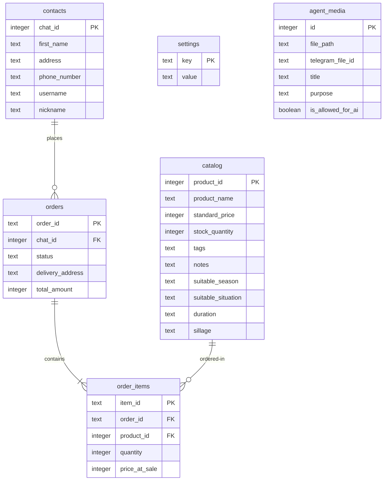

[← Configuration Guide](configuration.md) · [Back to README](../README.md)

# Database Reference

`telegram-bot-seller` utilizes a locally hosted **SQLite** database managed via an asynchronous connection pool. 

---

## SQLite Database Configuration

To support fast, concurrent operations (like concurrent user messaging and admin REST requests), SQLite is configured with advanced performance pragmas upon pool connection:

*   **Write-Ahead Logging (WAL) Mode**: Enables concurrent read and write operations without database locking. Readers do not block writers, and writers do not block readers.
    ```sql
    PRAGMA journal_mode=WAL;
    ```
*   **Foreign Keys Enforcement**: Strict constraint checks on relational tables.
    ```sql
    PRAGMA foreign_keys=ON;
    ```

---

## Schema Overview

The database contains 6 relational tables that represent the core of the business:



### Tables Reference

1.  **`contacts`**: Stores customer profiles initiated by Telegram interactions.
2.  **`catalog`**: High-resolution perfume details including metadata utilized by the AI recommendation agent (tags, season, notes, sillage).
3.  **`orders`**: Customer order tracking.
4.  **`order_items`**: Individual items linked to a parent order.
5.  **`settings`**: Key-value system configurations and system tokens.
6.  **`agent_media`**: Tracks media file locations and their Telegram file identifiers, mapping what files are permitted for AI usage.

---

## Automatic Migration Runner

Database migrations are defined inside the `src/migrations/` directory. Rather than relying on external command-line migrations, migrations are embedded directly inside the compiled binary via the `include_str!` macro.

On application startup, the pooled connection check verifies if the schema is updated and applies `001_init.sql` automatically. This makes deployment and local setups zero-configuration.

---

## See Also

*   [Architecture Overview](architecture.md) — Discover where the DB pool is integrated.
*   [Configuration Guide](configuration.md) — Customizing the `DATABASE_PATH` destination.
